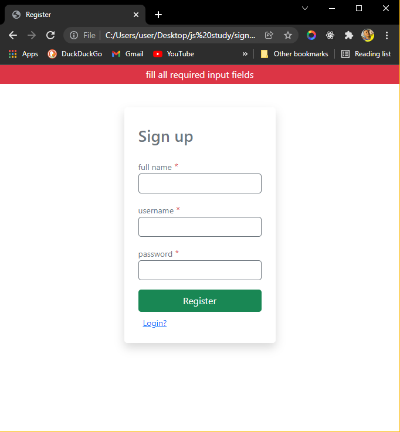
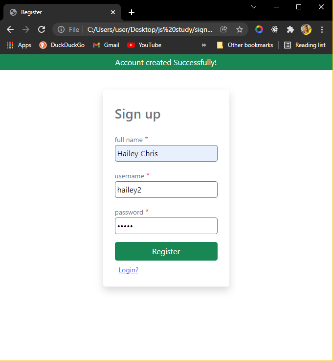
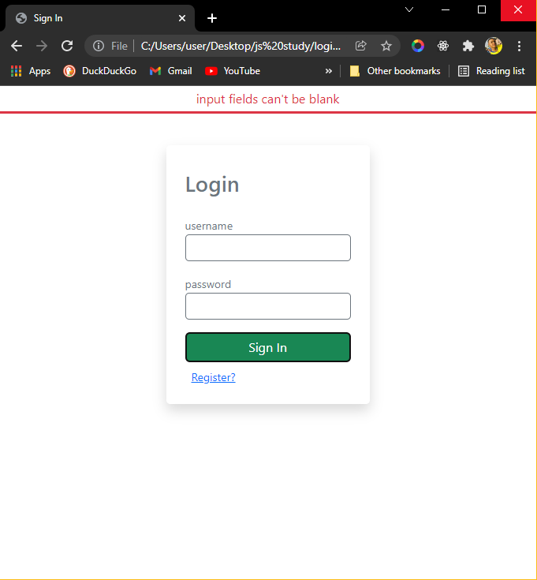
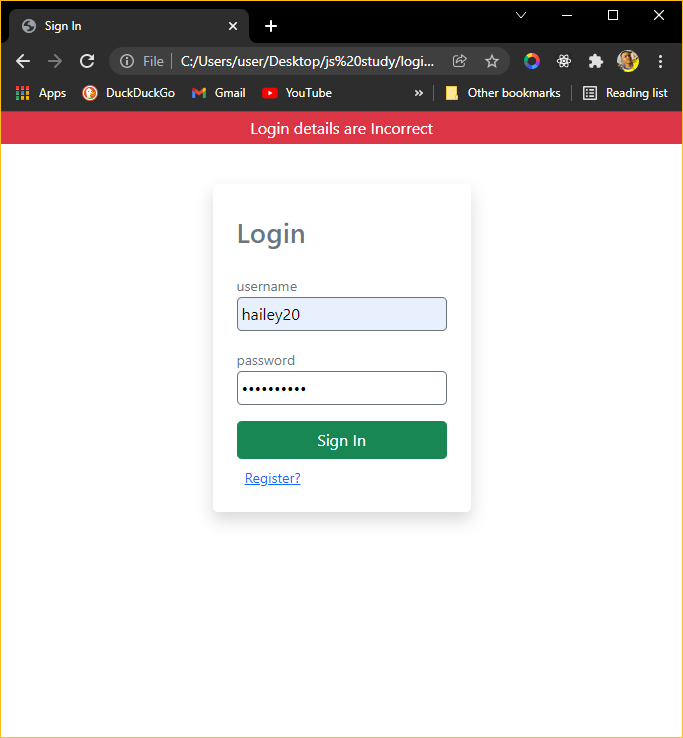
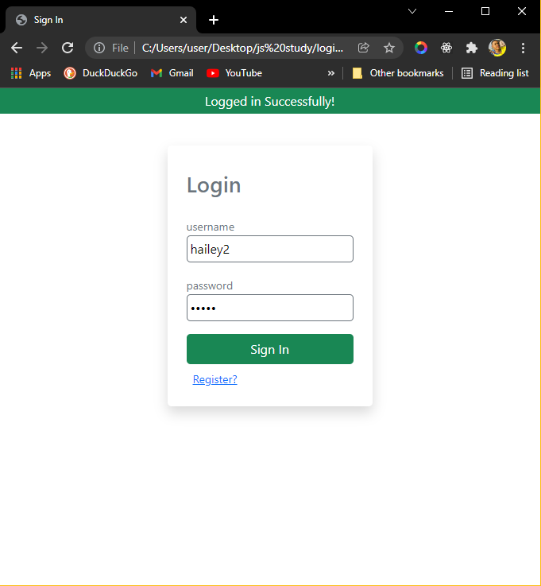
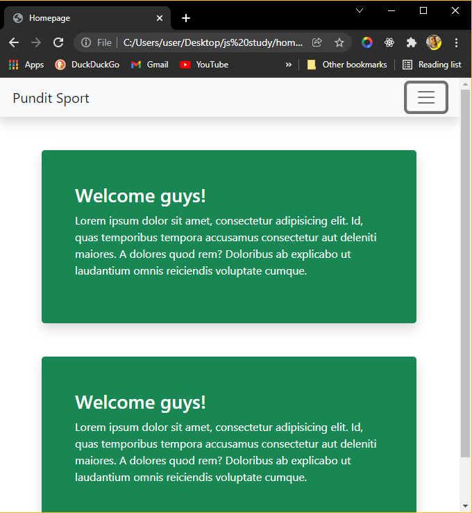
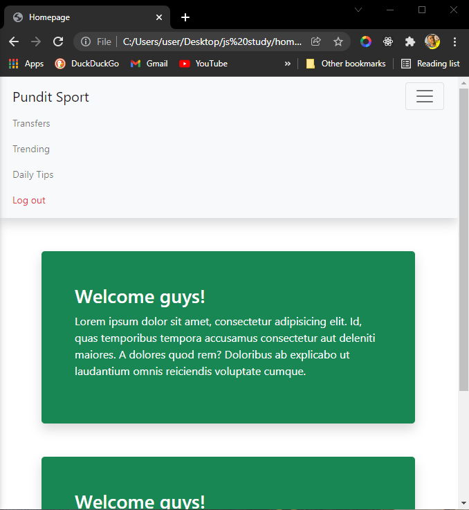

## User Authentication Using LocalStorage
This project was aimed at validating user login details using local storage.
##### Built using: `Vanilla Js, Bootstrap 5 and Local Storage`

First off, an account gets created, 
then the user logs into the app, using their login info/details.

PS: This is a Single User App.
Hence, every new account that gets created overrrides the previous stored data, saved in the local storage.

#### Previews from the App
##### Sign up Screen: required inputs error message

##### Sign up Screen: Account created successfully

##### Log in Screen: empty input field

##### Log in Screen: incorrect login details

##### Log in Screen: Successful login

##### Home page

##### Home page: Navbar

